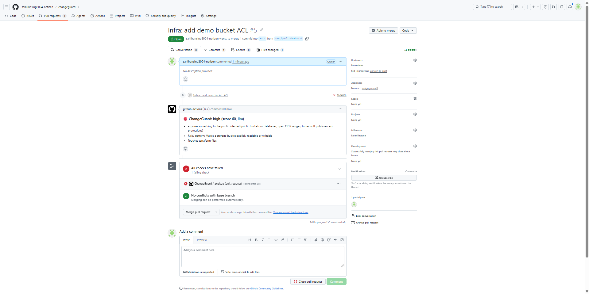
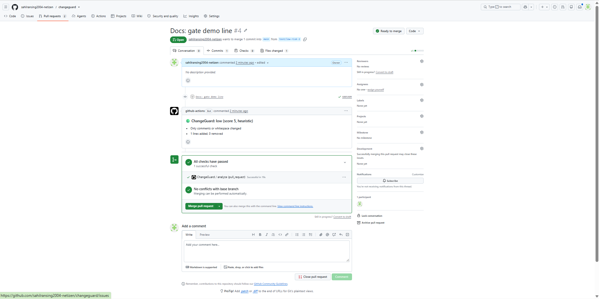
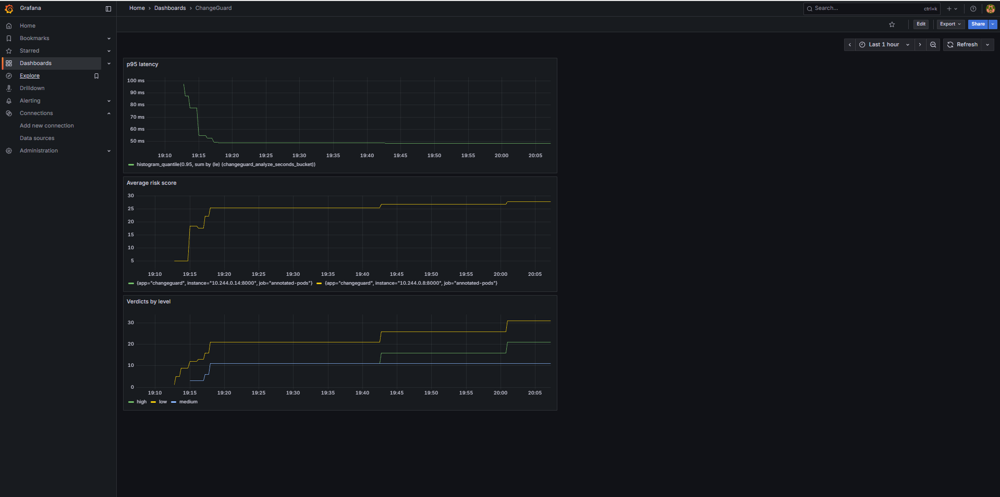

# ChangeGuard

AI-assisted change-risk gate for pull requests. It scores a diff as low, medium or high risk, comments on the PR, and fails CI on high.

**Stack:** FastAPI, Ollama (llama3.2:3b), RAG over 9 incidents and runbooks, GitHub Actions (self-hosted runner), Kubernetes (Minikube, Argo CD), Prometheus, Grafana.

## How it works
1. A PR triggers the workflow on a self-hosted runner.
2. The runner posts the diff to `/analyze`.
3. A rule table and a comment-only check set a floor. The LLM scores the change. The final score is the max of the two.
4. The PR gets a comment with the level and reasons. High fails the check, medium warns, low passes.

Architecture: [docs/architecture.md](docs/architecture.md)

## Evaluation
Four labelled sets of diffs. Read the status column: the sets differ in how much I tuned on them.

| Set | Status | Rules only | LLM + rules | High-risk recall | False blocks |
|---|---|---|---|---|---|
| v1 (18) | tuned on | 78% | 67% | 6/6 | 2/12 |
| v2 (10) | partly tuned | 50% | 60% | 4/4 | 1/6 |
| v3 (13) | used to choose the prompt | 38% | 77% | 5/5 | 1/8 |
| v4 (10) | mostly held-out (3 cases overlap v3) | 50% | 90% | 3/3 | 1/7 |

- **The LLM does the real work.** Rules alone catch none of the high-risk changes on v3 and v4. They cover only known strings.
- **A stricter prompt beat a higher-accuracy one.** The earlier prompt scored higher on v1 (89%) but missed 3 of 5 high-risk changes on v3. I kept the stricter one, since a missed high-risk change costs more than a false block.
- **RAG showed no measurable accuracy gain on any set.** It adds related past incidents to the output.
- Sets are small (51 cases total). Treat percentages as rough. v1 to v3 were run before the Ollama seed was pinned.

## Observability
`/metrics` exposes verdicts by level and source, risk-score and latency histograms, and an LLM-fallback counter. Prometheus scrapes annotated pods and Grafana shows the dashboard.

## Limitations
- The cluster deployment runs rules-only, because the pod could not reach host Ollama from WSL. The LLM path runs on the self-hosted runner.
- The gate depends on the service and runner running on one machine.
- The score behaves like a class label (29, 30, 60, 70), not a calibrated probability.
- The model over-scores some resource-limit changes (for example a memory limit cut) as high.
- Rules match known strings only, and comment detection is prefix-based.
- `0.0.0.0/0` is flagged even on egress rules.
Run `pytest -q` to run the unit tests.
Gate demo line.
