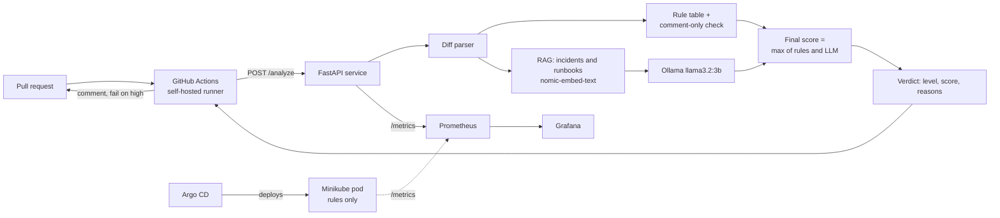

# Architecture

```mermaid
flowchart LR
    PR[Pull request] --> GHA[GitHub Actions<br/>self-hosted runner]
    GHA -->|POST /analyze| API[FastAPI service]
    API --> PARSE[Diff parser]
    PARSE --> RULES[Rule table +<br/>comment-only check]
    PARSE --> RAG[RAG: incidents and runbooks<br/>nomic-embed-text]
    RAG --> LLM[Ollama llama3.2:3b]
    RULES --> MAX[Final score =<br/>max of rules and LLM]
    LLM --> MAX
    MAX --> VERDICT[Verdict: level, score, reasons]
    VERDICT --> GHA
    GHA -->|comment, fail on high| PR
    API -->|/metrics| PROM[Prometheus] --> GRAF[Grafana]
    ARGO[Argo CD] -->|deploys| K8S[Minikube pod<br/>rules only]
    K8S -.->|/metrics| PROM
```
